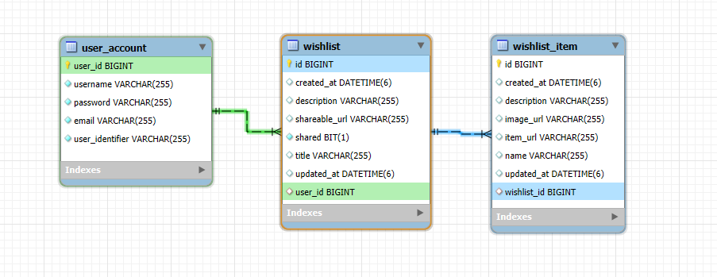
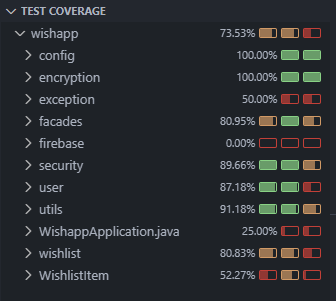

# Wishlist App Backend


## Table of Contents

- [Project Overview](#project-overview)
- [Features](#features)
- [Technologies Used](#technologies-used)
- [Requirements](#requirements)
- [Installation](#installation)
- [Running the Application](#running-the-application)
- [API Endpoints](#api-endpoints)
- [Database Schema](#database-schema)
- [Testing](#testing)
- [Tools](#tools)
- [Story Behind the Project](#story-behind-the-project)
- [Frontend Repository](#frontend-repository)

## Project Overview

The **Wishlist Application** is a backend service designed to help users manage their personal wishes, goals, and desired items. Built with Java and Spring Boot, it provides secure and efficient APIs for user authentication, wishlist management, and wish tracking. Image storage is seamlessly integrated with Firebase, ensuring scalability and reliability.

## Features

- **User Authentication**
  - Register new accounts
  - Secure login with JWT
- **Wishlist Management**
  - Create, read, update, and delete wishlists
  - Share wishlists via unique URLs
- **Wish Management**
  - Add, edit, and remove wishes within wishlists
  - Attach images and item URLs to wishes
- **Secure Storage**
  - Image uploads handled by Firebase
- **Robust Security**
  - Implemented with Spring Boot Security and JWT
- **Comprehensive Testing**
  - Achieves over 70% test coverage

## Technologies Used

- **Backend Framework:** Java 21, Spring Boot 3.2.9
- **Build Tool:** Maven
- **Database:** MySQL 8.0-debian (via Docker)
- **Authentication:** Spring Boot Security, JJWT
- **Environment Management:** Dotenv
- **Image Storage:** Firebase
- **Utilities:** Lombok
- **Containerization:** Docker Compose

## Requirements

- **Java:** Version 21
- **Maven:** Latest stable version
- **Docker:** Latest stable version
- **Firebase Bucket:** For image storage

## Installation

1. **Clone the Repository**

    ```bash
    git clone https://github.com/OlenaAndrushchenko/wishlist-app-backend.git
    cd wishlist-app-backend
    ```

2. **Set up .env**

    Create a .env file in the root directory and define the following variables:

    ```bash
    CONTAINER_NAME=your_container_name
    MYSQL_ROOT_PASSWORD=your_root_password
    MYSQL_DATABASE=your_database_name
    MYSQL_USER=your_mysql_user
    MYSQL_PASSWORD=your_mysql_password
    MYSQL_PORT=3306

    API_JWT_KEY=your_jwt_key
    STORAGE_BUCKET=your_firebase_storage_bucket
    ```
3. **Configure Firebase**

    Ensure you have a Firebase bucket set up and update the STORAGE_BUCKET variable accordingly.

## Running the Application

1. **Start Docker Containers**

    From the root directory, run:
    ```bash 
    docker compose up
    ```
    This command will set up the MySQL database using Docker.

2. **Run the Spring Boot Application**

    In a new terminal window, navigate to the project root and execute:
    ```bash 
    mvn spring-boot:run
    ```
    The application will start on the default port (http://localhost:8080)


## API Endpoints

### Account Management

- **Get Account Details**

    ```
    GET /api/v1/account
    ```
- **Update Account Details**
    ```
    PUT /api/v1/account
    ```

### User Registration and Authentication
- **Register a New User**
    ```
    POST /api/v1/register
    ```
    * Public
- **Login**
    ```
    POST /api/v1/auth/login
    ```
    * Public
### Wishlist Management
- **Create a Wishlist**
    ```
    POST /api/v1/wishlists/create
    ```
- **Get a Wishlist by ID**
    ```
    GET /api/v1/wishlists/{id}
    ```
    * Also returns the associated wishlist items or an empty array

- **Update a Wishlist**
    ```
    PUT /api/v1/wishlists/{id}
    ```
- **Delete a Wishlist**
    ```
    DELETE /api/v1/wishlists/{id}
    ```
- **Get All Wishlists**
    ```
    GET /api/v1/wishlists
    ```
- **Get a Shared Wishlist**
    ```
    GET /api/v1/wishlists/shared/{userIdentifier}/{shareableUrl}
    ```
     * Public
     * Also returns the associated wishlist items or an empty array
     * A wishlist need to be `shared` `True`

### Wish Management
- **Create a Wish**
    ```
    POST /api/v1/wishlist-items/create
    ```
- **Get a Wish by ID**
    ```
   GET /api/v1/wishlist-items/{id}
    ```
- **Update a Wish**
    ```
    PUT /api/v1/wishlist-items/{id}
    ```
- **Delete a Wish**
    ```
    DELETE /api/v1/wishlist-items/{id}
    ```

## Database Schema
The application uses MySQL as its database, managed via Docker. The primary tables include:



## Testing
The application maintains a test coverage of over 70%.




## Tools
* Development:
    - Java 21
    - Spring Boot
    - Maven
    - Docker
    - MySQL Workbench
    - Postman

* Project Management:
    - Jira

* Others:
    - Firebase

## Story Behind the Project

Everyone has dreams, goals, and items they wish to acquire over time. When assigned a project to develop an application, I questioned why not create a platform to capture and manage these personal wishes. Thats how the **Wishlist Application** was born. It allows users to:

- **Create an Account**: Secure registration and login.
- **Manage Wishlists**: Organize wishes into various wishlists.
- **Track Wishes**: Add, edit, and delete wishes with detailed information.
- **Share Wishlists**: Share your aspirations with others via unique URLs.

This project not only serves as a practical tool for personal goal setting but also showcases the integration of modern technologies to deliver a seamless user experience.

## Frontend Repository
The frontend for this application is available [here](https://github.com/OlenaAndrushchenko/wishlist-app-frontend)


####
Developed with ❤️ by Olena
